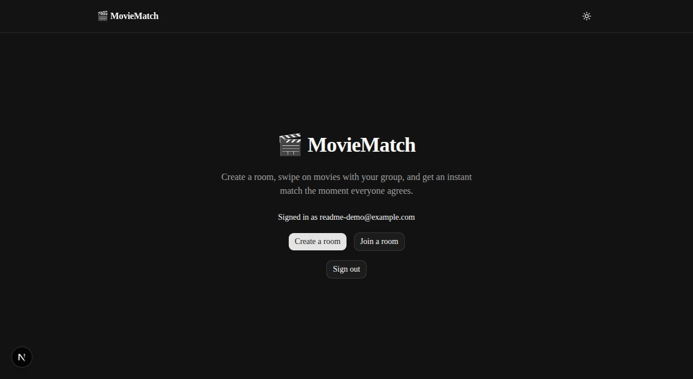
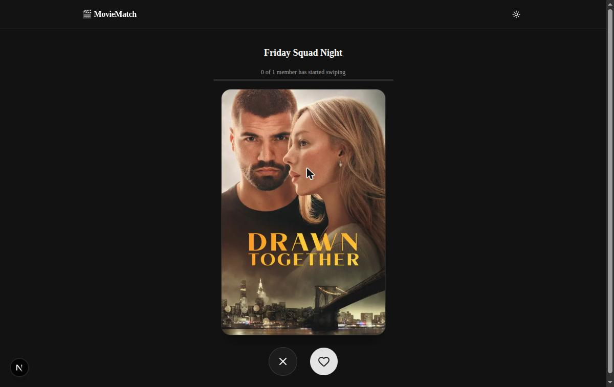
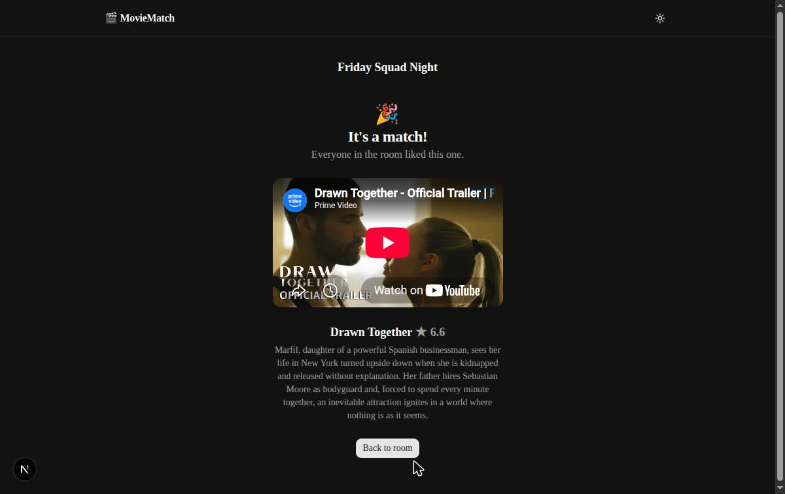

# 🎬 MovieMatch

A group creates a room, everyone swipes yes/no on movies, and the app announces a match the
instant everyone likes the same one.

**Live:** [moviematch-sooty.vercel.app](https://moviematch-sooty.vercel.app)

|                                          Home                                           |                                    Swipe screen                                     |                                Match celebration                                 |
| :-------------------------------------------------------------------------------------: | :---------------------------------------------------------------------------------: | :------------------------------------------------------------------------------: |
|  |  |  |

## What it does

1. Sign up or log in (Google OAuth or email/password).
2. Create a room — optionally filter by genre and region — and get a 6-character shareable code
   and link.
3. Share the link or code; anyone who opens it and is signed in joins the room's lobby
   automatically.
4. Everyone swipes through the same ordered stack of movies (drag the card, or use the pass/like
   buttons).
5. Every swipe is saved. A small progress bar shows how many members have started swiping,
   updated every ~3 seconds.
6. The instant every member in the room has liked the same movie, everyone's screen switches to a
   match celebration with the trailer embedded.
7. Rooms expire automatically 24 hours after creation (or the host can end one early); anyone can
   leave a room they've joined.

## Tech stack

- **Next.js 16** (App Router, TypeScript, Turbopack)
- **Tailwind CSS v4** + **shadcn/ui** (Base UI primitives)
- **Framer Motion** for the swipe-card drag gestures
- **Prisma ORM 7** (driver-adapter based) + **Postgres** via **Neon** (Vercel Marketplace)
- **Auth.js (NextAuth v5)** — Google OAuth + email/password (Credentials), Prisma adapter
- **TMDB API** for movie data (popular/trending/discover, genres, videos), via a small typed
  server-side client
- **SWR** for polling live room/vote/match state
- **Jest** for unit tests, **Playwright** for an end-to-end flow
- Deployed on **Vercel**, with a **Vercel Cron Job** for room expiry

## Local setup

**Prerequisites:** Node.js 24+, a Postgres database (Neon recommended — see below), a Google OAuth
client, and a TMDB account.

```bash
git clone <this-repo>
cd moviematch
npm install
```

Create `.env.local` from the template and fill in the values (see [Environment
variables](#environment-variables) below):

```bash
cp .env.example .env.local
```

Set up the database. If you're using Neon via the Vercel Marketplace, linking the project and
running `vercel env pull .env.local` will populate `DATABASE_URL` and `DATABASE_URL_UNPOOLED` for
you; otherwise point `DATABASE_URL`/`DATABASE_URL_UNPOOLED` at any Postgres instance. Then run the
migrations:

```bash
npx prisma migrate deploy
```

Start the dev server:

```bash
npm run dev
```

Open [http://localhost:3000](http://localhost:3000).

### Other useful commands

```bash
npm run lint         # ESLint
npm run typecheck    # tsc --noEmit
npm run format       # Prettier (writes)
npm run test         # Jest unit tests
npm run test:e2e     # Playwright e2e (needs a running dev server + real DB/TMDB credentials)
npm run build        # production build
```

## Environment variables

| Variable                                    | Required for            | Notes                                                                                                                                                               |
| ------------------------------------------- | ----------------------- | ------------------------------------------------------------------------------------------------------------------------------------------------------------------- |
| `DATABASE_URL`                              | App runtime             | Pooled Postgres connection string (Neon's `-pooler` host).                                                                                                          |
| `DATABASE_URL_UNPOOLED`                     | Prisma CLI (migrations) | Direct, non-pooled connection string. Neon's pooler runs in a mode that breaks migrations.                                                                          |
| `NEXTAUTH_SECRET`                           | Auth.js                 | Random secret used to sign session tokens. Generate with `openssl rand -base64 32`.                                                                                 |
| `NEXTAUTH_URL`                              | Auth.js                 | The app's base URL (`http://localhost:3000` locally).                                                                                                               |
| `GOOGLE_CLIENT_ID` / `GOOGLE_CLIENT_SECRET` | Google sign-in          | From [Google Cloud Console](https://console.cloud.google.com/apis/credentials). Add `<url>/api/auth/callback/google` as an authorized redirect URI.                 |
| `TMDB_API_KEY`                              | Movie data              | TMDB **v4 Read Access Token** (not the shorter v3 API key), from [TMDB API settings](https://www.themoviedb.org/settings/api).                                      |
| `CRON_SECRET`                               | Room-expiry cron        | Checked against the `Authorization` header on cron-triggered requests. Vercel sets this automatically for Cron Jobs on deploy; generate your own for local testing. |

See `.env.example` for the same list in file form.

## Architecture notes

- **Route protection without middleware.** Every protected server component/action/route calls a
  `requireUser()` (or `auth()`) helper directly instead of relying on Next.js middleware/`proxy.ts`
  — this sidesteps any Auth.js/App-Router middleware interop questions and keeps auth checks
  colocated with the code that needs them.
- **Prisma 7 driver adapters.** The runtime `PrismaClient` (`src/lib/prisma.ts`) uses
  `@prisma/adapter-neon` over the pooled `DATABASE_URL`. The Prisma CLI (`prisma7.config.ts`) uses
  the direct `DATABASE_URL_UNPOOLED` instead, since Neon's connection pooler runs in PgBouncer
  transaction mode, which migrations can't use.
- **No persisted movie deck.** Rather than storing an ordered movie list per room, the swipe deck
  is derived on each page load from TMDB's `discover` endpoint using the room's genre/region
  filters (`src/lib/rooms/movies.ts`). Since discover results are sorted by popularity and don't
  change quickly, every member's request returns (in practice) the same order without needing extra
  schema or a snapshot step.
- **Match detection lives in the vote endpoint.** `POST /api/rooms/[code]/votes` persists the vote
  and then checks whether every current room member now has a "liked" vote for that movie
  (`src/lib/rooms/matches.ts`). If so, it upserts a `Match` row — idempotently, since concurrent
  votes can race to create the same match (see the commit history for a concurrency bug this
  actually surfaced and how it was fixed).
- **One polling endpoint for everything live.** `GET /api/rooms/[code]/state`, polled via SWR every
  ~3s, returns member/vote counts and the latest match (with TMDB details and trailer key already
  resolved). The swipe screen swaps in the match celebration the moment it sees a match — no
  separate match-polling endpoint.
- **Room lifecycle.** Rooms get a 24h `expiresAt` at creation. A daily Vercel Cron Job
  (`/api/cron/expire-rooms`, see `vercel.json`) marks rooms past their expiry as `expired` and
  prunes rooms that have been expired for 7+ days. The host can also end a room early, and any
  member can leave one.

## Deployment (Vercel)

1. Push this repo to GitHub (or your Git provider of choice) and import it into Vercel.
2. Provision Postgres: install **Neon** from the Vercel Marketplace and connect it to the project
   (this sets `DATABASE_URL`/`DATABASE_URL_UNPOOLED` automatically). Then run
   `npx prisma migrate deploy` against it (e.g. via `vercel env pull` locally, or a one-off
   deploy step).
3. Set the remaining environment variables from the table above in the Vercel project settings
   (`NEXTAUTH_SECRET`, `NEXTAUTH_URL` — your production URL, `GOOGLE_CLIENT_ID`/`_SECRET`,
   `TMDB_API_KEY`). Add your production callback URL
   (`https://<your-domain>/api/auth/callback/google`) to the Google OAuth client.
4. `CRON_SECRET` is set automatically by Vercel for projects with Cron Jobs configured
   (see `vercel.json`) — no action needed there.
5. Deploy. The cron job runs daily without further setup once the project is live.
